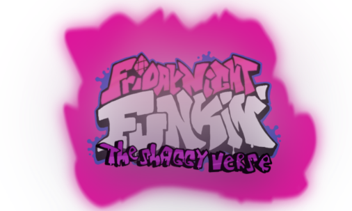

This is the repository for The Shaggyverse, the ultimate Friday Night Funkin': Vs Shaggy showdown!

## Links

- [Gamebanana Page](https://gamebanana.com/mods/346863)

## Build Instructions 

### IMPORTANT:

IF YOU GET ANY ERRORS THAT SEEM TO RELATE TO `POLYMOD` (or `NULL OBJECT REFERENCE` / `VALUE EXCEPTION`) RUN `haxelib install polymod 1.3.0` OR `haxelib set polymod 1.3.0` TO SET POLYMOD TO 1.3.0 BECAUSE 1.4.0+ SEEMS BROKEN AS OF NOW.

For build instructions go to [Build.md](https://github.com/Leather128/LeatherEngine/blob/master/Build.md)

## Credits

* KadeDev - Code for downscroll & Modcharts

* SrPerez - Original 9 Key and 6 Key Designs

* larsiusprime - Scrollable Drop Down Menu

* PolybiusProxy - .mp4 Video Loader Extension (I got this from [Psych-Engine](https://github.com/ShadowMario/FNF-PsychEngine))

* datee - Developing HaxeVLC (all the contents in the 'vlc' folder belongs to datee).

* Video LAN Team - People who made VLC Media Player (the thing the game uses to play videos)

* Ronezkj15 - Some Ideas + New Leather Engine Logo

* ShadowMario - Color Swap Shader (for notes and stuffs) + some really weird modchart stuff that im too stupid to know lol

* Smokey555 - Adobe Animate Spritemap -> FlxFramesCollection Support
